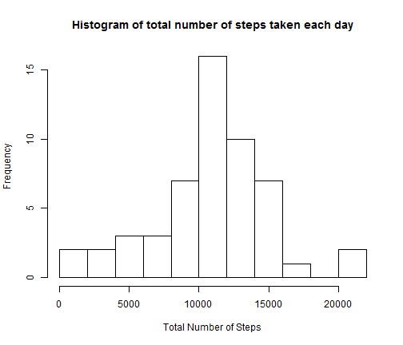
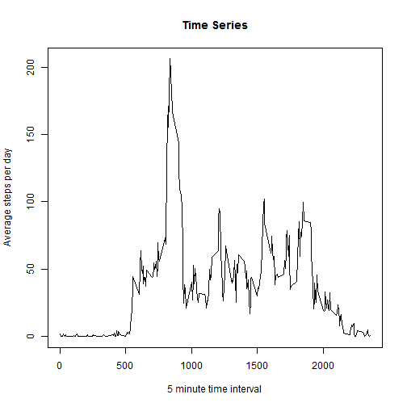
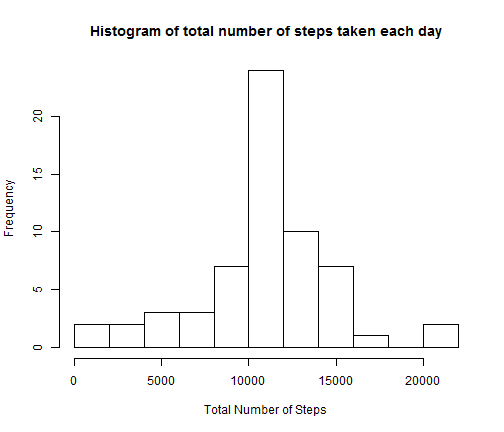
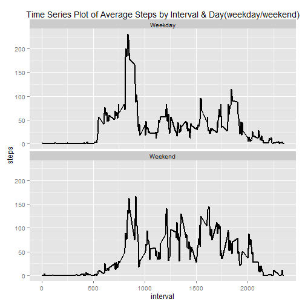

## Loading and preprocessing the data


```r
#Loading the Libraries
library (knitr)
library(data.table)
library(ggplot2)
library(dplyr)
```

```r
#Setting the global options for knitr
opts_chunk$set(echo = FALSE, results = 'hide', tidy = TRUE)
```

Reading the Data:

```r
# Reading the data
activity <- read.csv(file = "D:/DataScience/ReproducibleResearch/Proj 1/Repo/activity.csv", 
    stringsAsFactors = FALSE, sep = ",")
# Cleaning the data
activity$date <- as.Date(activity$date)
activity.complete <- activity[!is.na(activity$steps), ]
```
Below is a sample of the activity data

```
##   steps       date interval
## 1    NA 2012-10-01        0
## 2    NA 2012-10-01        5
## 3    NA 2012-10-01       10
## 4    NA 2012-10-01       15
## 5    NA 2012-10-01       20
## 6    NA 2012-10-01       25
## 7    NA 2012-10-01       30
```
## What is mean total number of steps taken per day?

```r
steps_per_day <- aggregate(formula = steps ~ date, data = activity.complete, 
    FUN = sum)
steps_per_day.mean <- round(mean(steps_per_day$steps), 0)
steps_per_day.mean_text <- as.character(steps_per_day.mean)
steps_per_day.median <- round(median(steps_per_day$steps), 0)
steps_per_day.median_text <- as.character(steps_per_day.median)
```

* The mean number of steps per day is 10766.
* The median number of steps per day is 10765.


```r
hist(steps_per_day$steps, breaks = 15, main = "Histogram of total number of steps taken each day", 
    xlab = "Total Number of Steps")
```

 

## What is the average daily activity pattern?


```r
steps_per_interval <- aggregate(formula = steps ~ interval, data = activity.complete, 
    FUN = mean)
steps_per_interval.max <- steps_per_interval[steps_per_interval$steps == max(steps_per_interval$steps), 
    ]
max_interval <- steps_per_interval.max$interval
max_interval.steps <- as.character(round(steps_per_interval.max$steps, 0))
plot(steps_per_interval$interval, steps_per_interval$steps, type = "l", main = "Time Series", 
    xlab = "5 minute time interval", ylab = "Average steps per day")
```

 

The 5-minute interval of 835 has the maximum average of 206  steps per day.


## Imputing missing values


```r
missing_value_count <- sum(is.na(activity$steps))
```

The total number of missing values in the dataset are 2304.

Filling the missing values with the mean number of steps taken in the interval.

```r
activity.full <- merge(x = activity, y = steps_per_interval, by = "interval", 
    all.x = TRUE)
s <- c("steps.x", "steps.y")
activity.full[is.na(activity.full$steps.x), s[1]] <- activity.full[is.na(activity.full$steps.x), 
    s[2]]
activity.full <- activity.full[, c("interval", "date", "steps.x")]
colnames(activity.full)[3] <- "steps"
```
below is the extract of the filled dataset. It has not missing values

```r
head(activity.full, n = 7)
sum(is.na(activity.full$steps))
```

```
##   interval       date    steps
## 1        0 2012-10-01 1.716981
## 2        0 2012-11-23 0.000000
## 3        0 2012-10-28 0.000000
## 4        0 2012-11-06 0.000000
## 5        0 2012-11-24 0.000000
## 6        0 2012-11-15 0.000000
## 7        0 2012-10-20 0.000000
## [1] 0
```
Calculating Mean, Median & Histogram based on the filled dataset:

```r
steps_per_day_full <- aggregate(formula = steps ~ date, data = activity.full, 
    FUN = sum)
steps_per_day_full.mean <- round(mean(steps_per_day_full$steps), 0)
steps_per_day_full.mean_text <- as.character(steps_per_day_full.mean)
steps_per_day_full.median <- round(median(steps_per_day_full$steps), 0)
steps_per_day_full.median_text <- as.character(steps_per_day_full.median)
```

* The mean number of steps per day is 10766.
* The median number of steps per day is 10766.


```r
hist(steps_per_day_full$steps, breaks = 15, main = "Histogram of total number of steps taken each day", 
    xlab = "Total Number of Steps")
```

 

After filling in the missing data based on averages by interval, the is an insignificant change in the median. There is a small impact of imputing the missing data on the estimates of the total daily number of steps which does not seem to distort any decision making.

## Are there differences in activity patterns between weekdays and weekends?


```r
activity.full$day <- as.factor(ifelse(weekdays(activity.full$date) %in% c("Monday", 
    "Tuesday", "Wednesday", "Thursday", "Friday"), "Weekday", "Weekend"))
steps_per_interval_day <- aggregate(x = activity.full$steps, by = list(activity.full$interval, 
    activity.full$day), FUN = mean)
colnames(steps_per_interval_day) <- c("interval", "day", "steps")
# build the plot
dayplot <- ggplot(steps_per_interval_day, aes(x = interval, y = steps, size = 3)) + 
    ggtitle("Time Series Plot of Average Steps by Interval & Day(weekday/weekend)") + 
    facet_grid(. ~ day) + geom_line(size = 1)
dayplot
```

 
